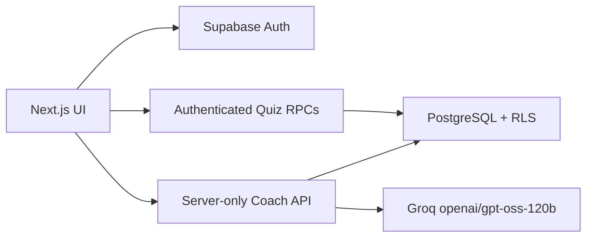

# CyberAI

CyberAI is a polished, responsive cybersecurity learning platform that turns security-awareness training into measurable practice. Learners complete lessons, answer scenario-based quizzes, record their confidence, unlock rewards, and receive persisted AI coaching after each completed attempt.

**Repository:** [github.com/PreetiPatra16/CyberAI](https://github.com/PreetiPatra16/CyberAI)

## Product Highlights

- Eight complete cybersecurity learning modules with lessons, quizzes, and cheat sheets.
- Email/password authentication and isolated anonymous demo accounts.
- Server-controlled quiz scoring, resumable attempts, best-score tracking, and confidence insights.
- Dashboard, profile, badges, cheat sheets, certificate, responsive navigation, and persisted light/dark themes.
- Groq-powered post-quiz coaching using `openai/gpt-oss-120b`, validated structured output, deterministic fallback, and Coach History.
- Fully reproducible Supabase schema, RLS policies, RPCs, and seed content through ordered SQL migrations.

## Tech Stack

| Layer | Technology |
| --- | --- |
| Frontend | Next.js App Router, React, strict TypeScript, Tailwind CSS |
| Backend | Supabase Auth, PostgreSQL, Row Level Security, security-definer RPCs |
| AI | Groq Chat Completions API, `openai/gpt-oss-120b`, JSON Schema output |
| Testing | Vitest, TypeScript, ESLint, production build verification |
| Deployment | Vercel-ready Next.js application with hosted Supabase |

## Architecture

The browser never determines quiz correctness or final scores. Authenticated Supabase RPCs validate attempts, calculate points, finalize progress, and award badges. The Groq key remains server-side; the model receives only topic-level performance and confidence signals.



See [Architecture](docs/ARCHITECTURE.md) for the detailed data and request flow.

## Local Setup

Requirements: Node.js 20+, npm, a Supabase project, and optionally a Groq API key.

```bash
git clone https://github.com/PreetiPatra16/CyberAI.git
cd CyberAI
npm install
cp .env.example .env.local
```

Configure `.env.local`:

```dotenv
NEXT_PUBLIC_SUPABASE_URL=https://YOUR_PROJECT_REF.supabase.co
NEXT_PUBLIC_SUPABASE_ANON_KEY=YOUR_PUBLISHABLE_OR_ANON_KEY
GROQ_API_KEY=YOUR_GROQ_API_KEY
```

Reproduce the backend in an empty Supabase project:

```bash
npx supabase login
npx supabase link --project-ref YOUR_PROJECT_REF
npx supabase db push
```

Enable email/password signups and anonymous sign-ins in Supabase Auth, then run:

```bash
npm run dev
```

Supabase is required. `GROQ_API_KEY` is optional; if Groq is unavailable, CyberAI
persists deterministic post-quiz coaching instead.

Detailed setup instructions: [Supabase Setup](docs/SUPABASE_SETUP.md).

## Verification

```bash
npm run verify
```

This runs linting, strict type checking, focused tests, and the production build.

## Key Engineering Decisions

- SQL migrations are the source of truth for schema, security, and learning
  content.
- Scoring and reward decisions are performed by authenticated database
  functions, never trusted from browser state.
- One active attempt per learner/module is enforced and created idempotently.
- RLS isolates every learner's attempts, responses, progress, badges, and AI
  coaching.
- Correct answers and explanations are not shipped in frontend content.
- AI coaching receives no profile, email, answer text, or attempt identifier.
- AI output is schema-validated and persisted once per completed attempt.

## AI-Assisted Development

Codex was used throughout specification, implementation, debugging, review, and
verification. All generated work was reviewed, tested, and committed in
human-verified checkpoints. See [AI Workflow](AI_WORKFLOW.md) for prompts,
workflows, and concrete examples.

## Submission Guides

- [Architecture](docs/ARCHITECTURE.md)
- [Demo Guide](docs/DEMO_GUIDE.md)
- [Deployment Guide](docs/DEPLOYMENT.md)
- [Decision Log](docs/DECISIONS.md)
- [Specification](docs/SPEC.md)
- [Submission Checklist](docs/SUBMISSION_CHECKLIST.md)
- [Supabase Setup](docs/SUPABASE_SETUP.md)
