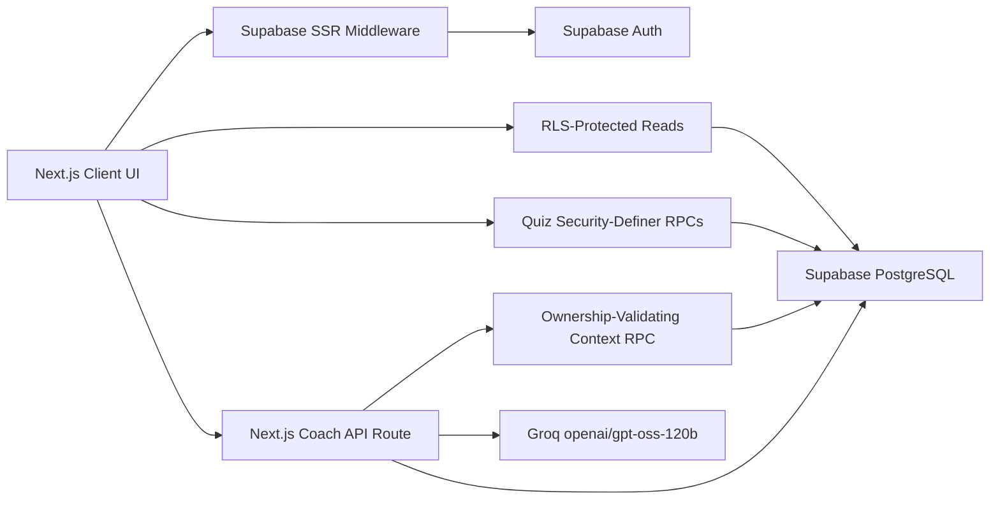
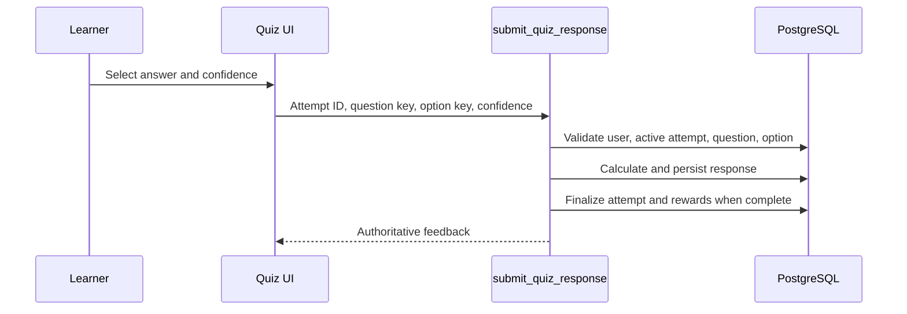
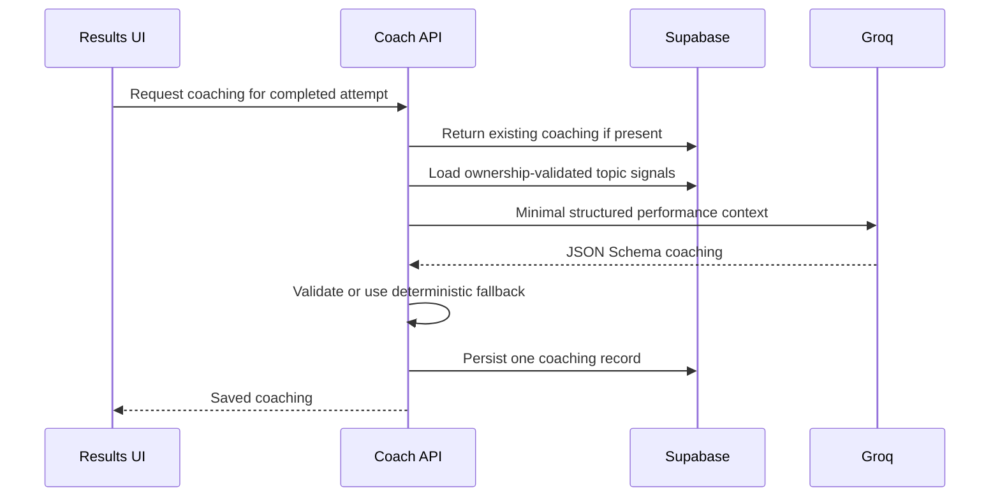

# Architecture

## System Overview

## Application Boundaries

### Browser

- Renders lessons, dashboard, quiz interactions, results, rewards, and history.
- Uses the authenticated Supabase session.
- Reads only columns permitted by grants and RLS.
- Never calculates authoritative correctness, score, pass state, or rewards.

### Supabase

- Auth creates real and anonymous users.
- PostgreSQL stores catalog content and learner data.
- RLS limits every learner-owned table to `auth.uid()`.
- Security-definer RPCs validate ownership and perform quiz calculations.
- Ordered migrations reproduce the complete backend.

### Coach API

- Runs server-side and owns `GROQ_API_KEY`.
- Validates the current Supabase user.
- Loads an ownership-validated, topic-level attempt context.
- Returns existing coaching or generates exactly one persisted response.
- Uses JSON Schema output and deterministic fallback coaching.

## Core Data Flow

### Quiz Submission

### Persisted AI Coaching

## Important Tables

- `profiles`: learner display name and theme.
- `modules`, `lesson_sections`, `questions`, `question_options`,
  `cheat_sheet_items`, `levels`: data-driven learning catalog.
- `quiz_attempts`, `quiz_responses`: retained authoritative attempt history.
- `module_progress`, `earned_badges`: learner rewards and best-score progress.
- `quiz_coaching`: immutable persisted AI/deterministic coaching per attempt.

## Security Notes

- The frontend catalog excludes correct-answer keys and explanations.
- Database grants prevent clients from selecting protected question columns.
- Quiz writes happen only through authenticated RPCs.
- Result and coach-context RPCs verify attempt ownership.
- `GROQ_API_KEY` is server-only.
- Service-role credentials are not used by the application.
